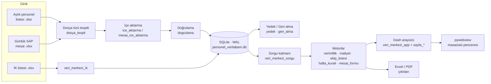

<div align="center">

# MAOG Veri Merkezi

**Şantiye personeli için puantaj, fazla mesai, verimlilik ve maliyet yönetim uygulaması**

[](https://github.com/okansaygin/maogverimerkezi/actions/workflows/ci.yml)


</div>

---

Veri Merkezi; aylık personel (kimlik) listelerini ve günlük SAP mesai dosyalarını tek bir **kalıcı SQLite
veritabanında** toplar, doğrular ve bunlardan yönetim raporları üretir. Dash ile yazılmış arayüz,
**pywebview** sayesinde tarayıcı çubuğu olmayan yerel bir masaüstü penceresinde açılır; internet
bağlantısı gerektirmez.

## İçindekiler

- [Özellikler](#özellikler)
- [Ekranlar](#ekranlar)
- [Kurulum](#kurulum)
- [Çalıştırma](#çalıştırma)
- [Mimari](#mimari)
- [Proje yapısı](#proje-yapısı)
- [Testler](#testler)
- [Yapılandırma](#yapılandırma)
- [Veri güvenliği](#veri-güvenliği)
- [Sürüm notları](#sürüm-notları)

## Özellikler

| Alan | Açıklama |
|---|---|
| **İçe aktarma sihirbazı** | Yüklenen Excel'in türünü (personel listesi / günlük SAP mesai) başlıklardan otomatik tanır, sütun eşleştirmesini gösterir, önce **önizleme** yapar, onayla yazar. |
| **Doğrulama kuralları** | TC kimlik sağlaması, anormal saat, çakışan kayıt vb. bağımsız kurallar kataloğu (`veri_merkezi_dogrulama.py`); sonuçlar *Veri Kalitesi* ekranında. |
| **Geri alma ve geçmiş** | Her içe aktarma kaydedilir; değişen puantaj günlerinin eski değerleri saklanır (`puantaj_history`) ve bir içe aktarma güvenle **geri alınabilir**. |
| **Verimlilik analizi** | Devam, fazla mesai, pazar çalışması, yevmiye, risk uyarıları; ekip ve kişi karnesi; biçimli **Excel raporu**. |
| **Hafta tatili / pazar kuralı** | Yevmiyenin tek kaynağı (`veri_merkezi_hafta_kurali.py`): ×1 / ×1,5 / ×2,5 katsayıları haftanın tamamına bakarak uygulanır. |
| **Personel kartı** | Kimlik bandı, sahada acil durum bilgileri, İSG/evrak süreleri, aylık takvim, İK kaydı, değişiklik geçmişi; karta özel Excel çıktısı. |
| **Raporlar** | Ekip listesi, personel maliyet raporu, SAP puantaj aktarımı, **günlük mesai formu (PDF)**. |
| **Otomatik yedekleme** | Açılışta, her içe aktarma / geri alma / şema yükseltmesi öncesinde tutarlı SQLite yedeği; arayüzden geri yükleme. |
| **Çevrimdışı çalışma** | Bootstrap, ikonlar ve yazı tipleri bir kez indirilip yerelden sunulur. |
| **Tanı günlüğü** | Sayfa açılış süreleri, analiz süreleri ve tarayıcı hataları `veri_merkezi_gunluk.log` dosyasına yazılır. |

## Ekranlar

| Menü | Sayfa | Adres |
|---|---|---|
| — | Genel Bakış | `/` |
| Veri Girişi | İçe Aktar · SAP Puantaj Aktarım | `/ice-aktar` · `/sap-puantaj-aktarim` |
| Denetim | Veri Kalitesi · İçe Aktarma Geçmişi | `/kalite` · `/gecmis` |
| Kayıtlar | Personel (+ Personel Kartı) · Puantaj Geçmişi · Ekip Listesi | `/personel` · `/puantaj` · `/ekip-listesi` |
| Raporlar | Verimlilik Analizi · Maliyet Raporu | `/verimlilik` · `/maliyet` |
| Sistem | Ayarlar | `/ayarlar` |

## Kurulum

Gereksinim: **Python 3.10+** (Windows 10/11 veya Linux).

```bash
git clone https://github.com/okansaygin/maogverimerkezi.git
cd maogverimerkezi

python -m venv .venv
# Windows:  .venv\Scripts\activate
# Linux:    source .venv/bin/activate

pip install -r requirements.txt
python kontrol.py        # eksik dosya / paket kontrolü
```

> **Günlük Mesai Formu (PDF)** Türkçe karakterler için DejaVu Sans yazı tiplerini kullanır. `DejaVuSansCondensed.ttf`
> ve `DejaVuSansCondensed-Bold.ttf` dosyalarını `fonts/` klasörüne koyun (lisans: [`DejaVu_LICENSE.txt`](DejaVu_LICENSE.txt)).
> Bulunamazsa sistemdeki DejaVu / Liberation / Arial denenir.

## Çalıştırma

```bash
python veri_merkezi_main.py      # masaüstü penceresinde açar (önerilen)
python veri_merkezi_app.py       # geliştirme: tarayıcıda açar
python puantaj_suite.py          # ayrı PySide6 aracı: Puantaj & Raporlama Merkezi
```

İlk açılışta uygulama klasöründe `personel_veritabani.db` oluşturulur (varsa şeması otomatik yükseltilir, önce yedeği alınır).

Yeni bir İK listesi geldiğinde (uygulama kapalıyken):

```bash
python veri_merkezi_ik.py "PERSONEL LİSTESİ.xlsx"
```

Tek dosyalık `.exe` (isteğe bağlı):

```bash
pip install pyinstaller
pyinstaller --onefile --windowed --name VeriMerkezi veri_merkezi_main.py
```

## Mimari



- **Sorgu katmanı** (`veri_merkezi_sorgu.py`): arayüz ve rapor motorları ham Excel'e değil, yalnızca bu API'ye erişir.
- **Şema** (`veri_merkezi_sema.py`): sürümlü migrasyonlar; yalnızca yeni tablo/sütun ekler, veri silmez.
- **Sayfalar** (`veri_merkezi_sayfa_*.py`): her sayfa kendi düzenini ve callback'lerini kaydeder; kabuk ve yönlendirme `veri_merkezi_app.py`'dedir.

## Proje yapısı

```text
.
├── veri_merkezi_main.py            # Giriş noktası (Dash sunucusu + pywebview penceresi)
├── veri_merkezi_app.py             # Uygulama kabuğu: menü, yönlendirme, genel arama
├── veri_merkezi_sayfa_*.py         # Sayfalar (genel, ice_aktar, kalite, gecmis, personel, puantaj, ekip, verimlilik, raporlar, sap, ayarlar)
├── veri_merkezi_ui.py              # Ortak arayüz bileşenleri
├── veri_merkezi_sorgu.py           # Sorgu katmanı (tek veri API'si)
├── veri_merkezi_sema.py            # Veritabanı şeması ve migrasyonlar
├── personnel_db.py                 # Personel veri seti motoru
├── veri_merkezi_ice_aktarma.py     # Personel bilgileri içe aktarma
├── veri_merkezi_mesai_ice_aktarma.py
├── veri_merkezi_dosya_tespit.py    # Excel türü tespiti ve sütun eşleştirme
├── veri_merkezi_dogrulama.py       # Doğrulama kuralları kataloğu
├── veri_merkezi_geri_alma.py       # İçe aktarmayı geri alma
├── veri_merkezi_yedek.py           # Yedekleme / geri yükleme
├── veri_merkezi_hafta_kurali.py    # Yevmiye: hafta tatili ve pazar kuralı
├── veri_merkezi_verimlilik*.py     # Verimlilik analizi + Excel raporu
├── veri_merkezi_personel_karti.py  # Personel kartı
├── veri_merkezi_ik.py              # İK listesi içe aktarma (komut satırı)
├── veri_merkezi_mesai_formu.py     # Günlük mesai formu (PDF, reportlab)
├── veri_merkezi_ayarlar.py         # Ayarlar (veri_merkezi_ayarlar.json)
├── veri_merkezi_varliklar.py       # Çevrimdışı CSS/ikon/yazı tipi
├── veri_merkezi_baslangic.py       # Açılış öncesi yazma izni kontrolü
├── veri_merkezi_surum.py           # Tek sürüm numarası
├── puantaj_suite.py                # Puantaj & Raporlama Merkezi (PySide6)
├── puantaj_engine.py · team_report.py · cost_report.py
├── kontrol.py                      # Kurulum kontrolü
├── assets/                         # CSS ve tarayıcı betikleri (Dash otomatik yükler)
├── testler/                        # Otomatik testler (unittest)
└── arsiv/                          # Kullanılmayan eski modüller (referans için)
```

## Testler

```bash
pip install -r requirements-dev.txt
python -m unittest discover -s testler -v
```

48 test; her biri kendi geçici klasöründe ve veritabanında çalışır, gerçek verinize dokunmaz.
Her push ve pull request'te GitHub Actions testleri Windows ve Linux üzerinde çalıştırır.

## Yapılandırma

Ayarlar uygulama içinden (**Sistem › Ayarlar**) değiştirilir ve `veri_merkezi_ayarlar.json` dosyasına yazılır
(dosya yoksa varsayılanlar kullanılır). Başlıcaları:

| Anahtar | Varsayılan | Açıklama |
|---|---|---|
| `proje_adi` | MAOG Projesi | Menüde ve raporlarda görünen ad |
| `yillik_fm_siniri` | 270 | Yıllık fazla mesai sınırı (saat) |
| `gunluk_azami_saat` | 11 | Günlük azami çalışma (saat) |
| `aylik_fm_esigi` | 52 | Aylık FM uyarı eşiği (saat) |
| `fm_katsayi_haftaici` / `fm_katsayi_pazar` | 1,5 / 2,5 | Fazla mesai katsayıları |
| `kesintisiz_gun_esigi` / `devamsizlik_esigi` | 7 / 3 | Uyarı eşikleri (gün) |
| `acilis_yedegi` / `yedek_saklama` | açık / 30 | Açılış yedeği ve saklanacak yedek sayısı |

## Veri güvenliği

Uygulama TC kimlik numarası, sağlık ve ücret bilgisi gibi **KVKK kapsamındaki kişisel veriler** işler.
Veritabanı, yedekler, günlük dosyası ve Excel/PDF çıktıları `.gitignore` ile repodan hariç tutulur; CI da bunu
denetler. Ayrıntılar: [SECURITY.md](SECURITY.md).

## Sürüm notları

Tüm değişiklikler için [CHANGELOG.md](CHANGELOG.md).
